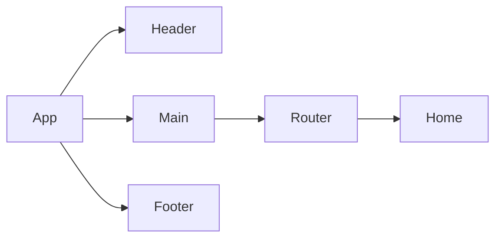

*A PRD (Product Requirements Document) is created before creating a product or feature and includes the planning required for developers to execute effectively. This document is usually prepared by Product Managers, read more [here](https://www.atlassian.com/agile/product-management/requirements)*

# Product Requirements Documentation

**Summary**
| Field | Detail |
|-------|--------|
| Project Name | devskillingit|
| Description | user can organize and journal dev skills |
| Developers | {Calvin Harris} |
| Live Website | {TBA} |
| Repo | https://github.com/Newbclharri/project2-my-skills-app

## Problem Being Solved and Target Market

The app allows organize of dev skills with linked resources and logs journals to track skill master progress

## User Stories

List of stories users should experience when using your application.

- Users should be able to see the site on desktop and mobile
- Users can create a new item
- Users can update items
- User can delete items

## Route Tables

For backend Applications you'll want to detail the different routes and types of your request your server can receive. There are three main things to define.

- The endpoint: /skills
- The method: GET
- The response: index page

- endpoint /skill
- method: POST
- response: redirect to index

- endpoint /journal
- method: POST
- response redirect to skills page

- endpoint: /skill/:id
- method: show
- response: show skill to edit skill name and resource

- endpoint: /edit/:id
- method: PUT
- response: redirect to index

- endpoint: /:id
- method: PUT
- resposne: redirect to index

- endpoint: /entry/:id
- method: DELETE
- response: redirect to index

- endpoint /:id
- method: DELETE
- response: redirect to index

You should also include any additional notes on any special headers that may be used and so forth.
N/A

## Component Architecture

You can use the [Mermaid Markdown Syntax](https://mermaid-js.github.io/mermaid/#/flowchart) to create a chart of how the parts of your frontend website relate to each other. Units should represent components of your page. The following is an example you may see in a Single Page Application like a React App.

## User Interface Mockups

Use tools like [Figma](https://www.figma.com/), [Mockflow](https://www.mockflow.com/) or [UXPIN](https://www.uxpin.com/). If you need inspiration visit a site like [Behance](https://www.behance.net/?tracking_source=typeahead_search_direct&search=web%20mockup). 

